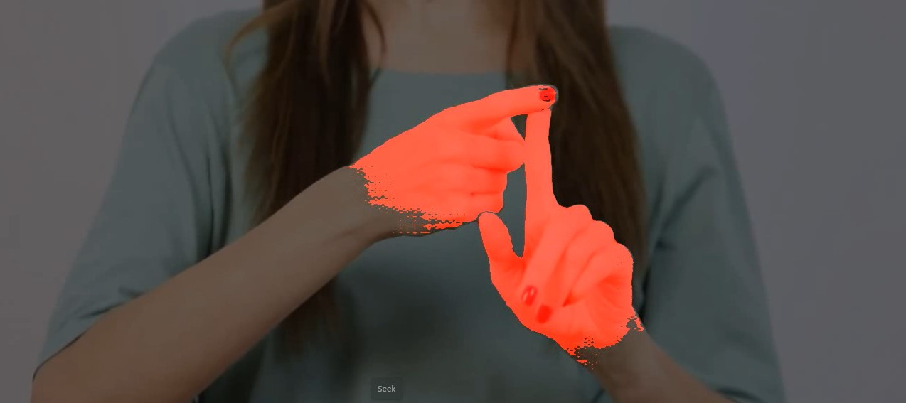

This repository provides two methods for detecting and segmenting hands in videos using **MediaPipe Hand Landmarker** for hand detection and **SAM2** for segmentation.

## Hand Locator
This project utilizes **MediaPipe Hand Landmarker** from Google’s MediaPipe Solutions for hand detection. It identifies hand landmarks and provides bounding box coordinates for further processing. More details can be found at: [MediaPipe Hand Landmarker](https://ai.google.dev/edge/mediapipe/solutions/vision/hand_landmarker).

## SAM2 for Segmentation
SAM2 is used to generate high-quality segmentation masks for detected hands. Depending on the approach, SAM2 can either process each frame independently or propagate masks across the entire video for efficiency. More details can be found at: [SAM2 on GitHub](https://github.com/facebookresearch/sam2).

## Method 1: Frame-by-Frame Processing
This approach processes each frame individually using:
- **MediaPipe Hand Landmarker**: Detects hand landmarks in each frame.
- **SAM2 Image Predictor**: Generates segmentation masks for each detected hand.
- **Overlay Processing**: Applies the mask to the frame and saves the processed video.

### File:
- `Frame by frame hand locator.py`

## Method 2: Video Propagation-Based Hand Tracking
This approach processes the video more efficiently using:
- **MediaPipe Hand Landmarker**: Detects hand landmarks in the first frame.
- **SAM2 Video Predictor**: Propagates the detected hand masks throughout the entire video using SAM2's video propagation feature.
- **Overlay Processing**: Applies the mask to frames and saves the processed video.

### File:
- `Video propagation hand locator.py`

## Input and Output Files
- The input video file path should be updated from the desired video location at **input_video** variable.
- The processed output video will be saved in the `output` folder with an appropriate filename where the path is saved in the **output_video** variable.

## Approach Comparison:
Two approaches are used:
- **Frame-by-Frame Processing**: This method consumes less time but the masks are a bit less satisfactory.
- **Video Propagation-Based Hand Tracking**: This approach takes more time but generates better masks for hands using the SAM2 video propagation feature.

## Downloading the Pretrained Checkpoint
To run the segmentation with SAM2, you need the pretrained checkpoint file sam2_hiera_large.pt. You can download it by setting the following URL:
**sam2_hiera_url="${SAM2_BASE_URL}/sam2_hiera_large.pt"**

Ensure that you have the correct base URL set in your environment or configuration file to allow the download of the checkpoint. This is required for running the segmentation models.